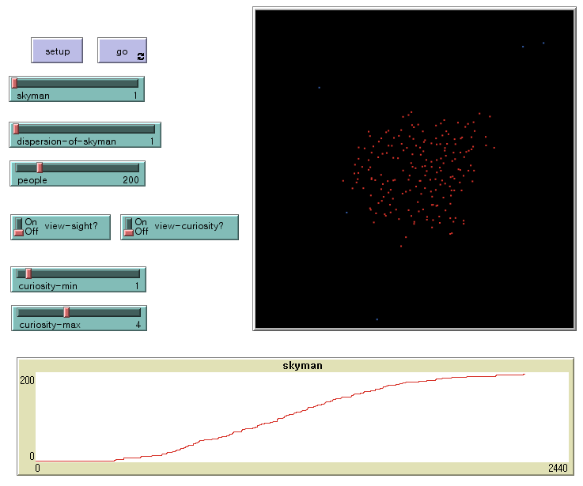
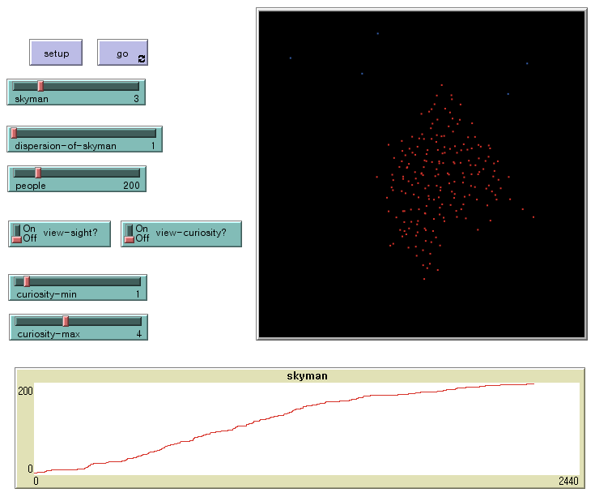

# rule-of-three-netlogo-simulation
Simulate the rule of three in the crowd psychology, using NetLogo.

### The rule of three
It refers to a phenomenon in which a group is formed when three people gather, indicating that the group's arguments are loaded with power.

### Experiment
* 1 person

* 2 person

* 3 person

### Reference
* https://www.youtube.com/watch?v=1g9LJ-lWQb4
